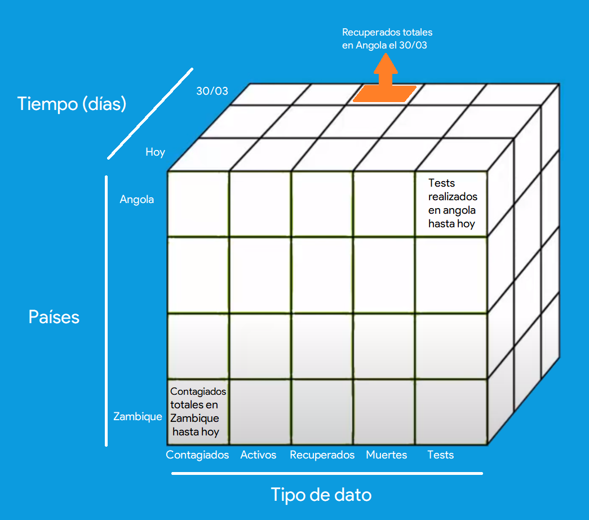
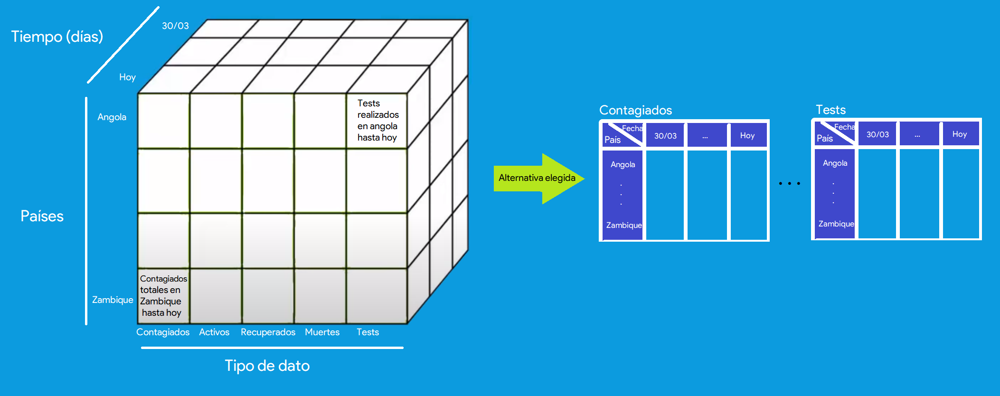

```{r setup, include=FALSE}
knitr::opts_chunk$set(echo = TRUE)

```
\hfill

^[Bibliogrfía al final del documento]

\newpage

# Enlances de interés

**Repositorio de Github**: https://github.com/AdrianArnaiz/scrap_uoc 

**DOI de Zenodo**: 10.5281/zenodo.3748050.

**Link a Zenodo**: https://zenodo.org/record/3748050#.XpD5w8gzZ9A 

\newpage
# Contexto
En el contexto actual de la situación del virus **COVID-19** es imprescindible poder tener datos sobre la situación actual de los países para poder actuar en consecuencia. Si se disponen de buenos datos y un buen modelo, se puede incluso predecir datos futuros para poder prevenir o gestionar de manera más efectica tanto recursos commo medidas a tomar. Sin embargo, se produce una gran acumulación de datos de diversas fuentes. Existen muchas y muy diversas fuentes de los datos de personas contagiadas, casos activos, pacientes recuperados, muertes... 

En este contexto de falta de homogeneidad y rigurosidad en los datos, nos adentramos a buscar fuentes de datos que pudieran ser candidatas a llevar un conteo diario (*serie temporal*) por país sobre: contagiados, casos activos, recuperados, muertes y tests realizados. El objetivo es realizar series temporales de estos datos por país con la función de realizar en un futuro análisis sobre los mismos. Nuestro contexto particular sería el de obtener estos datos tanto para **explicar comportamientos pasados, presentes como predecir futuros**. Incluso analizarlo minuciosamente comparando los datos de test realizados y casos totales o cualquier pareja de atributos, incluso analizando las series temporales de datos del COVID-19 con otros datos: PIB, exportaciones, valores bursátiles, densidades de población...

En **resumen**, digamos que nos queremos poner en la piel de instituciones como el CSIC o el INE y realizar estudio minucioso sobre el desarrollo de la enfermedad (tanto de la propia enfermedad, como su relacción con datos externos). Por ello, para comenzar **necesitamos los datos centralizados y rigurosos de la evolución contagiados, casos activos, recuperados, muertes y tests realizados por país y por día**. 

Hemos analizado muchas posibles fuentes de datos:

* *Oficiales (gobiernos)*: dificutad de recopilación de datos. Habría que buscar la vía por la que cada uno de los países realiza el comunicado y sacar los datos de ese comunicado (algunos comunicados son textos reales en pdf, se necesitaría una labor difícil de *NLP*.)
* *OMS*: En este caso, se debería pensar que es la fuente más fiable de los datos. Sin embargo, en el momento que empezamos a realizar esta práctica, no tenían una plataforma oficial donde se indicaran los datos por países. A esto se añade la poca fiabilidad que han tenido los datos de esta organización en las primeras fases de la epidemia.
* *European Centre for Disease Prevention and Control*: Permitía descargar un gran csv con datos. El motivo por la que no hemos elegido es porque sólo tiene datos de contagiados y muertes.
* *[Universidad de Oxford - Our world in data](https://ourworldindata.org/coronavirus)*: Se trata de un estudio interactivo y actualizado en tiempo real que está realizando la Universidad de Oxford sobre la pandemia. Intentan analizar múltiples aspectos de la enfermedad, sin embargo obtienen los datos a través de varias organizaciones (los casos de la OMS, las muertes de la Johns Hopkins e incluso tienen acuerdos). Hemos visto que obtiene los datos a través de la universidad **Johns Hopkins**. 
* **Johns Hopkins University**: Esta universidad ha tenido una visualización muy importante [@jhu], la cual ha aparecido en todos los medios de comunicación. Sin embargo, los datos les tienen en un repositorio Github deonde guardan los csv. También hemos visto que una de sus fuentes principales es **wolrdometers**.
* **\textcolor{blue}{Worldometers}**: Nos hemos decantado por worldmeters porque cumple con todas las funcionalidades que buscabamos: variedad en los datos, centralizados, rigurosos y actualizados dinámicamente. Deducimos que es **rigurosa** y de calidad por dos aspectos: el primero es que una universidad tan prestigiosa como la Johns Hopkins University la utiliza como fuente para su visualización. El segundo aspecto es por la completitud de datos (todos los atributos que queríamos, de muchos países y cada vez van añadiendo más). También, como vista de que es **dinámica** la propia página obtiene datos de diversas fuentes, pero si alguien da datos con justificantes de veracidad: los datos se actualizan (Ver Figura \ref{fig:1}). Por ello, consideramos esta página como un reposiutorio central de los datos del COVID. 

## Link a Worldometers - COVID-19
* Link a la página que contiene la tabla: https://www.worldometers.info/coronavirus.
  
{width=250px}

# Título del dataset
**Evolución de contagio del COVID-19 por países**.

# Descripción breve del dataset
El dataset tendrá la evolución temporal de 5 datos relativos al covid por países. Guardaremos los datos relativos a **contagiados, casos activos, recuperados, muertes y tests realizados**. Es decir para cada uno de los países en los que haya casos registrados, guardaremos un dato al día (de manera automática) cada uno de los datos recién enumerados. Al final, reflejamos la serie temporal de cada uno de esos datos por países.

Como podemos ver es un dataset de 3 dimensiones (Tipo de Dato, País y fecha). En la sección \ref{sec:cont}, explicaremos cómo lo hemos resuelto.

# Representación gráfica
El potencial actual de visualización que están sacando las asociaciones son gráficas de líneas para ver la evolución de los datos y gráficas de datos sobre el mapa para explicar evolución del contagio, mortalidad, etc. Entendemos que este apartado se refiere a representar el dataset de manera visual o esquemática, no a visualizaciones que se pueden obtener a partir del mismo. 

Como hemos comentado tiene 3 dimensiones:

* País: Paises con al menos un caso (así añade *worldometers países a su tabla*)
* Tiempo: Desde el 30/03 que empezamos a scrapear al menos 1 vez al día (la automática), hasta el día actual, ya que el scrap se lanza automaticamente con Travis todos los dias a las 10:00 GMT+0
* Tipo de Dato: datos que queremos registrar: contagiados, casos activos, recuperados, muertes y tests realizados.
Por tanto, lo representaremos gráficamente tal y como se ve en la Figura \ref{cubo}.

{width=500px}


# Contenido 

## Dataset \label{sec:cont}
Nuestros datos tienen los campos que hemos contado anteriormente, sin embargo, tenemos que explicar la solución que hemos tomado para plasmarlo en formato csv. Hay dos alternativas (ver Figura \ref{alternativas_csv}):



* Un único csv con las siguientes columnas: *País*, *Fecha*, *Contagiados*, *activos*, *recuperados*, *muertes*, *tests*. Así tendríamos una entrada en la tabla por cada par País-Fecha. Tendría $num\_filas = Pais\times Fecha$.
* **Varios csv**: Consiste en que una dimensión se utilice para dividir los datos en distintos csv. Es decir, un csv por cada *slice* del cubo. **Hemos utilizado esta alternativa** porque facilita la comprensión a la hora de ver los datos. Además, normalmente trabajaremos con un dato en concreto (p.e. analizar contagiados), por lo que si tenemos todo en un único csv, la mayoría de análisis empezarían con simular este slice que hemos explicado. Por lo tanto tenemos **5 csv**: la variación temporal de cada tipo de dato por país.

La estructura individual de cada uno de estos csv es la misma. Se encontrarán en el directorio `csv/covid_19_series` y cada archivo tendrá el nombre `{TipoDato}_covid19_timeserie.csv`, siendo `TipoDato` cada dato que hemos nombrado: *TotalCases*, *TotalDeaths*, *TotalRecovered*, *ActiveCases*, *TotalTests*. Cada csv tendrá como filas los países y como columna la fecha de cuando hemos realizado un scrapping (idealmente una al día, pero durante la fase de desarrollo hay días que hemos hecho más $\rightarrow$ se refinará en posteriores prácticas en la fase de limpieza de datos).

## Cómo se ha recogido
Hemos hecho scrapping sobre la página de [Worldometers-Coronavirus](https://www.worldometers.info/coronavirus), en el script alojado en el directorio `src\Scraping_covid19.py`. En el tenemos **una tabla** que muestra los **valores de los datos (contagiados, activos, etc) por país en el momento actual**. Es decir, las **filas los países y las columnas los datos del momento actual**. El sitio web **no dispone ni de robots.txt ni de sitemap.xml**. En cuanto a las características del scraping (pocas llamadas a una sola página), que no haya *robots.txt* ni *sitemap.xml* tampoco nos plantea un gran contratiempo.

Hemos hecho scraping sobre ese link, utilizando *BeautifulSoup* para encontrar la tabla y poder navegar sobre filas y columnas para recuperar los elementos. Hemos debido hacer la búsqueda en la tabla para quedarnos con los datos necesarios (p.e. a la hora de hacer el scrapping de la tabla, devuelve 8 filas el principio que no siguen el formato de la tabla, se deben corresponder con los resumenes por contienente, esas filas las hemos saltado en el scraping). 

Tras recuperar los datos de la tabla actual, está la **fase de actualización de datos** (o creación si es la primera vez que se lanza el script). Actualizamos las tablas con los datos nuevos, se añaden países si hay nuevos países en la tabla, y si hay países que antes estaban y ahora no queda su casilla a `Nan`. Todo ello con Pandas.

Puede surgir una pregunta: *¿Cómo se han obtenido datos de otras fechas?*. Nuestro enfoque ha sido **automatizar el lanzamiento del scraping** para que se ejecute una vez al día y se vayan **actualizando automáticamente los csv de las series temporales de los datos por país**. Por ello, la primera fecha de la que tenemos datos es del 30/03, que fue el primer día que teníamos desarrollado el scraping y lo lanzamos. La herramienta **Travis** ha sido utilizada para automatizar el lanzamiento del script y el *autodeploy* a *Github* (*Travis* permite que, en su plataforma, una vez al día y de forma planificada y automática se ejecute el scrapping, se actualizan las tablas de datos y se haga un commit automático para actualizar los datos en el github). Explicaremos como lo hemos hecho con travis en la sección \ref{sec:travis}.

Al código del scraping se le ha añadido una **salida tipo *logfile*** donde se reflejan los resultados de la ejecución de cada scraping. En nuestro caso es muy útil, ya que como se hace de manera automática nos deja ver cómo ha sido, la hora, si todo ha ido bien... Esto se ve reflejado en el fichero `src\log_covid.log`. 

En cuanto a estrategias anti-bloqueo cabe destacar que hemos implementado pocas por la naturaleza de nuestro scraping. Tal y como hemos explicado: solo hacemos **una petición al día** para recuperar la tabla de datos actuales y trabajamos con esa página ya descargada. En el paso del *request* a la página web sí que hemos **implementado reintentos con espera** (espaciando entre peticiones http), teniendo en cuenta tanto fallos de conexión (y nos dará excepción que capturamos y reintentamos), como fallos de mensajes (reintentamos si conectamos bien con la página pero nos devuelve un código diferente al 200). No vemos sentido a otras medidas como cambiar el *user-agent*, ya que con una petición al día no nos creará dificultades.

### Travis \label{sec:travis}
Comentaremos un poco en detalle cómo hemos automatizado la ejecución del scraping para auto-actualizar los csv una vez al día mediante un bot, ya que creemos que es una parte con mucho potencial de éste scraping. 

**Travis** es una herramienta de automatización de pruebas. Como muchos *frameworks* de automatización de pruebas, pueden utilizarse también para labores de *RPA* (automatizar procesos). *Travis* se conecta con Github, para ejecutar tests de pruebas que tengas codificados en el script que le indiques (debe estar en el repositorio). Se ejecuta automáticamente cada vez que haces un push o de manera planificada (diaria o mensualmente). Hemos utilizado esto para indicarle a ***Travis* que ejecute nuestro script de scraping una vez al día (no cada push) y haga un *deploy* de los resultados a *Github***. 

Para realizar ésto, solo necesitamos conectar nuestro repositorio con *Travis* y añadir la configuración en el archivo `.travis.yml` en la carpeta raíz de nuestro repositorio.

En el `Readme.md` de la raíz del proyecto, hay una marca que indica cómo ha ido el último scrapping (*passing* o *faillure*), ver Figura \ref{res}. Si se clica sobre ella, se ven los resultados del ultimo scraping en la plataforma de *Travis* (aunque no se tenga usuario se puede ver los resultados).

{width=400px}

Los pasos para su configuración son:

* Configurar el archivo `.travis.yml`.
* Registrarte en *Travis* y **activar** la conexión con tu repositorio. A partir de ahí, *Travis* ya sabe automáticamente que tiene que ejecutar por la configuración del anterior paso. Ver Figura \ref{tr1}.
* Crear un **token de conexión segura** para que se pueda realizar el deploy automáticamente (el push desde el bot de *Travis* para la actualización del *Github*). Ver Figura \ref{tr2}.
* Configurar lanzamiento automático una vez al día: Cron. Ver Figura \ref{tr4}.

{width=400px}

{width=400px}

{width=400px}

Ahora, todos los días a las 12:11 hora de España, el bot de Travis nos hará un commit actualizando los datos. El resultado de la ejecución en su máquina se ve clicando la marca en el `readme.md` anteriormente descrita.

# Agradecimientos
* Principalmente, agradecer a la asociación *Worldometers* [@worldo], asociación de estadísticas mundiales en tiempo real, por tener los datos actualizados de manera tan rápida y en abierto. 
* Después, tanto a los estudios de la *Johns Hopkins University* [@jhu], como a la asociación *Our world in Data* de la *Oxford University* [@roser2020coronavirus], por sus trabajos que nos han permitido descubrir fuentes da calidad.
* Agradecer los recursos encontrados para realizar el scraping, tanto en [@lawson2015web] como en el módulo [@webscrapuoc], propio de la UOC.


# Inspiración
Esta pregunta ha sido respondida en anteriores apartados. Pero resumiendo, pretendemos analizar el cómo se ha desarrolado en el pasado la enfermedad, **explicar en qué etapa estamos en el presente y poder predecir los valores futuros para una mejor prevención**. A parte, en el futuro podrán analizarse otros datos externos para ver su correlación o su influencia en la propagación o viceversa (valores bursatiles, etv).

La inspiración ha sido el clima actual de la pandemia y repitiendo lo dicho en el primer apartado, buscar homogeneidad y rigurosidad en los datos para elaborar correctamente las anteriores tareas.


# Licencia
Hemos elegido la licencia  **CC BY-SA 4.0 License** por los siguiente motivos:

* *Deberán seguir con esta licencia las contribuciones a éste trabajo*: se asegura que se seguirá utilizando como mínimo una licencia tan restrictiva como esta.

* *Cuando se hagan cambios sobre el trabajo, habrá que indicar dichos cambios y al autor original*: se sigue reconociendo la autoría y qué cosas ha aportado cada uno.

* *Se permite comercializar*, con lo que podremos conseguir llegar a más cantidad de personas si alguien utiliza nuestro dataset con este fin.


# Código fuente y dataset en Zenodo

* El código fuente del scraping, actualización de datos y autoimatización mediante *Travis* se encuentra en [este enlace](https://github.com/AdrianArnaiz/scrap_uoc). Además hay archivos `readmemd` en los directorios que dan más información del proyecto.

* El dataset (conjunto de 5 csv) se sube a *Zenodo*, sin embargo, cabe **destacar que debido al potencial añadido de la autoactualización con *Travis*, este dataset está en continua actualización diaria de los datos**. El dataset con mayor actualización se coresponderá al que tenemos en el repositorio.
  * **DOI de Zenodo**: 10.5281/zenodo.3748050.
  * **Link a Zenodo**: https://zenodo.org/record/3748050#.XpD5w8gzZ9A
  
\newpage

# Tabla de contribuciones
| Contribuciones       | Firma        |
|----------------------|--------------|
| Investigación previa | P.G.S, A.A.R |
| Redacción respuestas | P.G.S, A.A.R |
| Desarrollo de código | P.G.S, A.A.R |

\newpage

