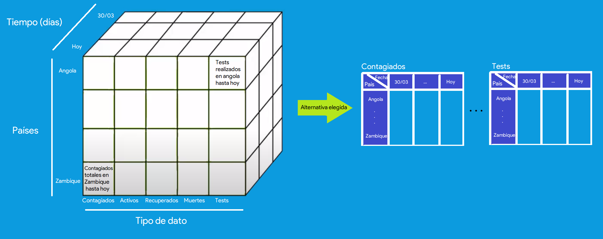
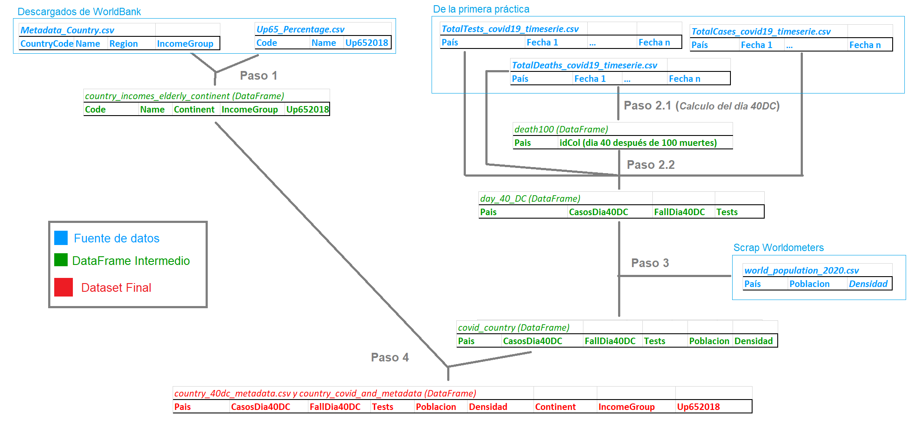

```{r setup, include=FALSE}
knitr::opts_chunk$set(echo = TRUE)

```
\hfill

^[Bibliografía al final del documento]

\newpage


# Enlances de interés

**Repositorio de Github**: https://github.com/AdrianArnaiz/scrap_uoc 

**DOI de Zenodo (Base de datos)**: 

 * Versión 1.0 (datos del 30 de Marzo al 10 de Abril): 10.5281/zenodo.3748050.
 * Versión 1.1 (datos del 30 de Marzo al 4 de Mayo): 10.5281/zenodo.3784400.
 * \textcolor{red}{Version final} 

**Link a Zenodo**: https://zenodo.org/record/3748050#.XpD5w8gzZ9A


\newpage

# Introducción

## Contexto
En el contexto de obtención del dataset explicado en la anterior práctica, nos gustaría realizar un análisis de varios aspectos de la pandemia por **Covid-19**. En este contexto es importante analizar con rigor diferentes aspectos de la pandemia, para dar lugar a conclusiones basadas en esos análisis.

## Análisis de datos sobre el COVID \label{sec:analisis}

Primero de todo, nos gustaría explicar la **complicación de las series temporales a la hora de realizar diferentes contrastes de hipótesis, correlaciones o predicciones**. 

### Contrastes de hipótesis

Se quiere realizar contrastes de hipótesis sobre la diferencia de afectación entre países o continentes. 

  * La primera complicación es que las *series temporales son muestras con gran autocorrelación en sus datos*, en la que cada observación es muy dependiente de las observaciones temporales anteriores, tienen un orden. Esto rompe el principio de independencia entre observaciones necesario para realizar la mayoría de los análisis estadísticos. Otro problema son los datos a comparar. Es decir, normalmente tenemos una muestra de datos asumiendo en primer lugar independencia (y después normalidad, además de que si lo comparamos con otra muestra también suponemos igualdad de varianzas), por ejemplo, una muestra de pesos y alturas de bebés. No podemos tratar nuestra serie temporal como una muestra de pesos, ya que en nuestra serie temporal las observaciones a lo largo del tiempo no son independientes. Por ello, no podemos realizar un típico contraste de hipótesis, tenemos que buscar otro enfoque.

  * Por otro lado, **para hacer un contraste de hipótesis se comparan distribuciones**. Si comparamos un dato de un dia concreto en el tiempo para dos países, son dos puntos individuales, que no tendrán varianza. Esto **lo resolvemos realizando contrastes de hipótesis sobre la proporción** [@contraste]. Consideramos el contagio o no como una variable que proviene de una distribución de Bernoulli con posibilidad de contagio $p$ y posibilidad de no contagiarse de $1-p$. Por ello compararemos las proporciones de contagio de dos países.

  * Cuando tomamos el dato de proporción de contagiados en un país, (i.e., si queremos hacer el contraste que acabamos de explicar para analizar si la proporción de contagiados en España e Italia se puede considerar igual o es diferente), no podemos considerar la serie temporal como la muestra y hacer la media, por que no tendría sentido (no tiene sentido realizar la media de una serie temporal para ver la proporción de afectados). **Deberemos elegir un punto en el tiempo** para ver la proporción de contagios ese día. Es **muy importante que para hacer un análisis justo, no debemos elegir el mismo día para los dos países**. Deberemos elegir un día para cada país de tal modo que esa proporción muestre la misma estapa dentro de la pandemia, es decir, **debemos tener en cuenta cuando llegó el COVID a cada país**. Por ello utilizaremos la estrategia que utilizan diferentes analistas, como por ejempo el New York Times, se elegirá el **Día 40 después de contabilizar 100 muertes**. 
  
  * Para ver la afectación por continentes, consideraremos diferentes muestras de los diferentes continentes. Cada continente tendrá $n$ proporciones, 1 de cada país que lo componga. Recordamos que la proporción de cada país ha sido obtenida como la proporción de contagiados el día 40 después de contabilizar 100 muertes. De este modo, **de cada continente tendremos una media de proporciones con una desviación, lo que nos permitirá relizar un análisis ANOVA**.
  
### Correlaciones

Como hemos comentado, una de las principales características que tienen las series temporales, sobre todo estas series derivadas de fenómenos epidemiológicos, es el alto grado de autocorrelación interna de sus datos que anula la hipótesis de independencia en las observaciones. Cuando nosotros realizamos contrastes de hipótesis o análisis de correlación (i.e. Pearson o Spearman), suponemos independencia en los datos, que no se cumple en las  series temporales. Por ejemplo, no es lo mismo analizar la correlación entre peso y altura de bebés (cada altura es independiente a las demás) que entre la serie temporal de casos de COVID y de índices económicos (los casos de COVID de un día son muy dependientes de los de ayer, autocorrelación).

Los datos de series de tiempo generalmente dependen del tiempo. La correlación de Pearson, sin embargo, es apropiada para datos independientes. Este problema es similar a la llamada regresión espuria [@spurius]. Es probable que el coeficiente sea muy significativo, pero esto solo proviene de la tendencia temporal de los datos que afecta a ambas series.Es por ello que el uso del coeficiente de correlación de (Pearson o Spearman) probablemente dará resultados engañosos para la interpretación de la estructura de dependencia entre series temporales [@yule1926we]. Es decir, esto puede dar como resultado que la asociación aparente es una mera ilusión causada por la dependencia dentro de la serie.

Para poder hacer una correlación objetiva entre ambas series se debería hacer una correlación cruzada entre diferentes lags, habiendo eliminado anteriormente. Entonces, para usar esta correlación, en lugar de suavizar la serie, en realidad es más común (porque es significativo) observar la dependencia entre los residuos [@agiakloglouspurious].

Como entendemos que esto está fuera del alcance actual, utilizaremos datos 'estáticos'. Es decir, datos de un instante de tiempo para los diferentes países, so series temporales. Utilizaremos la misma estrategia que venimos comentando, elegir la **proporción de casos del país el día 40 después de contabilizar 100 muertes**.

Con ello, ya podremos realizar las siguientes correlaciones:

  * Correlación entre proporción de contagiados (día 40 DC) y proporción de test realizados (día 40 DC)
  * Correlación entre proporción de contagiados (día 40 DC) y variación de los índices económicos.
  

### Regresión
La predicción de las series temporales del covid es quizá el tema más candente, y está poniendo en vista las grandes dificultades en la predicción de evolución de fenómenos epidemiológicos. Los principales problemas que ocurren en modelos epidemiológicos es que siguen un modelo exponencial. El fenómeno de contagio se basa en sofisticaciones del modelo SIR (con base en exponenciales). En el \textcolor{blue}{\href{https://arxiv.org/pdf/2004.08842.pdf}{paper de José Cuesta}} [@castro2020predictability] se llega a la conclusión de que estos modelos tienen mucha incertidumbre derivada de los parámetros elegidos, lo que da lugar a muchos escenarios diferentes. Tantos escenarios de confianza diferentes y sus intervalos de confianza, hace que no sea predecible de manera óptima los fenómenos epidemiológicos, dando innumerables escenarios sólo a 4 días vista.

Esta complejidad y dificultad hace que para nosotros intentar estimar el número de casos sea una tarea muy difícil. 

Sin embargo, con objetivo de aplicar algún modelo de *Time Series Forecasting* aplicaremos modelos de predicción utilizados en otras investigaciones, como el modelo autoregresivo ARIMA, y así ver cómo estima el modelo.

Por otro lado, intentaremos explicar la proporción de muertes basandonos en características sociodemográficas del país. Es decir, **intentaremos explicar la variable objetivo proporción de fallecidos a través de las diferentes variables explicativas densidad de población, porcentaje de mayores, riqueza del país, etc.**.


### Análisis que realizaremos

Por lo tanto, y resumiendo, los análisis a realizar serán los siguientes:

* Contrastes hipótesis:
  * Contraste proporciones Esp-Ita, Esp-Port, Esp-Ale
  * Contraste ANOVA entre continentes
* Correlaciones:
  * Correlación entre proporción de tests y proporción de contagiados.
  * Correlación entre variación de indice y numero de casos.
* Regresión:
  * Time Series Forecasting: ARIMA
  * Proporción a x días ~ densidad + %gente mayor  + etc

Como es de entender, no podemos realizar estos análisis solo con los datos de la primera práctica (cubo de dato país fecha). En el siguiente apartado, describiremos los dos diferentes dataset que utilizaremos con el objetivo de realizar estos análisis.


## Descripción del dataset

### Descripción breve general del dataset
Nuestro dataset evolucionará con respecto al de la primera práctica. Tendremos dos datasets, uno de series temporales de los datos del COVID (el de la primera práctica) y otro con datos estáticos de cada país. El motivo de tener dos datasets lo explicaremos más adelante en la sección \ref{alternativas_csv} y sobre todo en la sección \ref{alternativas_csv}. Por ello, a parte del cubo de datos País-Dato-Fecha, obtendremos datos de cada país de:

  * Total de población de cada país
  * Densidad de población
  * Continente
  * Porcentaje de población mayor

El dataset de la primera práctica tendrá la evolución temporal de 5 datos relativos al covid por países. Guardamos los datos relativos a **contagiados, casos activos, recuperados, muertes y tests realizados**. Es decir para cada uno de los países en los que haya casos registrados, guardamos un dato al día (de manera automática) cada uno de los datos recién enumerados. Al final, reflejamos la serie temporal de cada uno de esos datos por países. Por lo tanto, resultado de la anterior práctica, tenemos **5 csv**: la variación temporal de cada tipo de dato por país (ver Figura \ref{alternativas_csv}).



Por otro lado, tendremos un **dataset para cada país la proporción de contagiados y fallecidos el día 40 después de contabilizar 100 muertes, acompañado del número total de la población, densidad de población, continente, porcentaje de población mayor, etc**. Es decir, con datos estáticos, de un instante en el tiempo, no series temporales.


### Dataset final
Tendremos **dos datasets**, cada uno de ellos usado para un diferente tipo de análisis. 

* Por un lado tendremos el cubo de series temporales de los datos.
  * Lo utilizaremos para realizar análisis de series temporales. Concretamente la regresión con ARIMA.
* Por otro lado, tendremos una tabla final con datos de los países. Le llamaremos dataset de datos estáticos. 
  * Lo utilizaremos para los contrastes de hipótesis, correlaciones y regresión de la proporción de muertes a través de características sociodemográficas.
  * Lo explicamos más extensamente en la sección \ref{sec:analisis}. Contiene los datos de un país de manera estática, es decir: los datos de contagiados o fallecidos el día x después de las 100 muertes, datos de densidad, población, vejez de la población del país, nivel de ingresos, etc.
  
  
| País       | Continente | Contag dia 40 DC | Fallec dia 40 DC | tests dia 40 DC | Densidad  total | Población  | %vejez | Nivel Ingresos ONU  |
|------------|------------|-----------------|-----------------|-------------------|-----------|-----------|---------|---------------------|
| España     | Eu | n | n | n | n | n | n | st | n |
| Italia     | Eu | n | n | n | n | n | n | st | n |
| Zambique   | Af | n | n | n | n | n | n | st | n |


\newpage

## Cómo se ha recogido y fuentes

### Cubo de datos Dato-Pais-Fecha
Se detalló en la anterior práctica la recogida de datos del cubo Dato-Pais-Fecha. Hicimos scrapping sobre la página de [Worldometers-Coronavirus](https://www.worldometers.info/coronavirus), en el script alojado en el directorio *src-Scraping_covid19.py*. En esa página tenemos **una tabla** que muestra los **valores de los datos (contagiados, activos, etc) por país en el momento actual**. Es decir, las **filas los países y las columnas los datos del momento actual**. Nuestro enfoque ha sido **automatizar el lanzamiento del scraping** para que se ejecute una vez al día y se vayan **actualizando automáticamente los csv de las series temporales de los datos por país**. Por ello, la primera fecha de la que tenemos datos es del 30-03, que fue el primer día que teníamos desarrollado el scraping y lo lanzamos. La herramienta **Travis** ha sido utilizada para automatizar el lanzamiento del script y el *autodeploy* a *Github* (*Travis* permite que, en su plataforma, una vez al día y de forma planificada y automática se ejecute el scrapping, se actualizan las tablas de datos y se haga un commit automático para actualizar los datos en el github).

* Link a (Worldometers - COVID-19)[https://www.worldometers.info/coronavirus].

### Población y densidad de población

Ha sido realizado para esta segunda práctica:

* Se ha recogido mediante un scrapping en la ruta */src/scrap_population.py* a la página worldometers.
* Link a (Worldometers - Population)[https://www.worldometers.info/world-population/population-by-country/]: https://www.worldometers.info/world-population/population-by-country/.
* **Fichero final**: */csv/world_population_2020.csv*

### Continente, pocentaje mayores de 65 y nivel de ingresos del pais

Ha sido realizado para esta segunda práctica:

* Se ha utilizado la API de **WORLDBANK** para descargar metadatos de los países del último año. Tras descargar los datos tenemos dos ficheros csv. Uno con datos del % de mayores de 65 años de cada país, y otro para metadatos de contienente, nivel de ingresos...
* Link a [WorldBank](https://data.worldbank.org/indicator/SP.POP.65UP.TO.ZS?end=2018&start=2017): https://data.worldbank.org/indicator/SP.POP.65UP.TO.ZS?end=2018&start=2017
* Como resultado tenemos dos ficheros:
  * *csv/WorldBankData/Metadata_Country.csv*
  * *csv/WorldBankData/UP65_Percentage.csv*
  
### Índices bursátiles

Ha sido realizado para esta segunda práctica:

* Se han descargado directamente de la página web de Investing
* Link a (Investing)[https://www.investing.com/]: https://www.investing.com/.
* Se han descargado individualmente cada unos de los históricos de datos, buscando por el nombre de los índices de los países deaseados, desde 30/03/2020 hasta 28/05/2020 para que coincidan con el rango de tiempo scrapeado de la primera práctica. Para la obtención de los datos ha sido necesario crear una cuenta de carácter gratuito en la página web.
* **Ficheros finales**: */csv/Investing/*

\newpage

# Integración y selección de datos \label{sec:integracion}

Como se ha comentado necesitamos dos datasets: El cubo de series temporales y el dataset de datos estáticos. El cubo de series temporales ya lo tenemos realizado. Para **integrar los datos de diferentes origenes al dataset de datos estáticos realizaremos los siguientes pasos**:

1. Leer los dos CSV de **World Bank** (nuevos en esta práctica) para sacar los datos de continente, nivel de ingresos y porcentaje de población mayor de 65 años de cada país. Haremos un Join de ambos y nos quedaremos con los datos que queremos. Tendremos este $DF_1$.

| País       | Continente |  %vejez | Nivel Ingresos ONU  |
|------------|------------|---------|----------------------|
| España     | Eu | n | st | n |
| Italia     | Eu | n | st | n |
| Zambique   | Af | n | st | n |

2. Leer csv de series temporales de **Worldometers** (*cubo* de la primera práctica): leeremos 3 csv del *cubo* relativos a las series temporales de contagios, fallecidos y tests. Sacamos el dato estático de cada país. Es decir, calculamos para cada país su día **40 despues de llegar la pandemia (100 muertes)** y obtenemos los datos de contagiados, fallecidos y tests ese día. Tendremos este $DF_2$.

| País       | Contagiados día 40 DC | Fallecidos día 40 DC | tests/1M día 40 DC |
|------------|----------------------|---------------------|-------------------|
| España | n | n | n |
| Italia | n | n | n |
| Zambique | n | n | n |

3. Leemos el csv de la población y densidad de cada país de **Worldometers** (nuevo en esta práctica): cruzamos los datos del **paso 2** con la población para poder sacar proporciones cuando se necesiten. Tendremos este ampliado $DF_2$.

| País       | Contag dia 40 DC | Fallec dia 40 DC | tests/1M dia 40 DC | Población | Densidad |
|------------|------------------|---------------------|-------------------|-----------|----------|
| España | n | n | n | n | n |
| Italia | n | n | n | n | n |
| Zambique | n | n | n | n | n |

4. Hacemos join del dataset resultante de Worldometers y el de worldbank. Join de $DF_1$ y $DF_2$.

| País       | Continente | Contag dia 40 DC | Fallec dia 40 DC | tests/1M dia 40 DC | Densidad  | Población | %vejez | Nivel Ingresos ONU  |
|------------|------------|------------------|------------------|-------------------|-----------|-----------|---------|---------------------|
| España     | Eu | n | n | n | n | n | n | st | n |
| Italia     | Eu | n | n | n | n | n | n | st | n |
| Zambique   | Af | n | n | n | n | n | n | st | n |


Antes de empezar importaremos las librerías necesarias:

```{r loadlib, echo=T, results='hide', message=F, warning=F}

library(dplyr)
library(ggplot2)
library(knitr)
library(kableExtra)
library(forecast)
```

## Paso 1 - Leer WorldBank y hacer Join

Leemos metadatos del país.
```{r}

continente_ingresos <- read.csv(file="..//..//csv//WorldBankData//Metadata_Country.csv", 
                                header=T, fileEncoding="UTF-8-BOM")

continente_ingresos <- continente_ingresos %>% select(Country.Code, 
                                                      TableName, 
                                                      Region, 
                                                      IncomeGroup )
head(continente_ingresos)
```

Leemos serie de porcentaje de mayores y nos quedamos con el ultimo año con datos
```{r}
porcentaje_mayores <- read.csv(file="..//..//csv//WorldBankData//UP65_Percentage.csv",
                               header=T, fileEncoding="UTF-8-BOM")

porcentaje_mayores <- porcentaje_mayores %>% select(Country.Code, 
                                                    Country.Name, X2018)
head(porcentaje_mayores)
```

Hacemos join entre ambos dataframes para tener los datos de porcentaje de vejez y metadatos
```{r}
country_incomes_elderly_continent <-merge(porcentaje_mayores, continente_ingresos, 
                                          by.x="Country.Code", by.y="Country.Code")
country_incomes_elderly_continent <- country_incomes_elderly_continent %>% 
                                                    select(Country.Code,
                                                    Country.Name, 
                                                    Region, IncomeGroup, 
                                                    X2018)

country_incomes_elderly_continent <- country_incomes_elderly_continent %>% 
                                                    rename(Continent=Region,
                                                           UpTo65=X2018)
head(country_incomes_elderly_continent)
```

## Paso 2 - Leer series temporales del dataset cubo y calcular proporcion dia 40 Despues de 100 muertes para cada pais

También limpiaremos valores Na de indice de países (borrado de filas) y de los valores de los días. Si hay indice del país, que haya una casilla vacía (NaN significa que el número es 0, casilla vacía de la tabla de Worldometers).

Primero leemos los datos de las series temporales, que les necesitaremos para calcular el día 40 despúes de 100 muertes de cada país. Limpiamos países nulos y valores Nan.
```{r}
total_casos <- read.csv(file="..//..//csv//covid_19_series//TotalCases_covid19_timeserie.csv",
                        header=T, fileEncoding="UTF-8-BOM")
total_muertes <- read.csv(file="..//..//csv//covid_19_series//TotalDeaths_covid19_timeserie.csv",
                          header=T, fileEncoding="UTF-8-BOM")
total_tests <- read.csv(file="..//..//csv//covid_19_series//TotalTests_covid19_timeserie.csv", 
                        header=T, fileEncoding="UTF-8-BOM")

# Quitamos índices de países vacíos
total_casos <- total_casos[!is.na(total_casos$Country),]
total_muertes <- total_muertes[!is.na(total_muertes$Country),]
total_tests <- total_tests[!is.na(total_tests$Country),]

# Quitamos datos del mundo
total_casos <- total_casos[!total_casos$Country=='World',]
total_muertes <- total_muertes[!total_muertes$Country=='World',]
total_tests <- total_tests[!total_tests$Country=='World',]

# Limpiamos los casos donde hay Nan en la medida: será 0.
total_casos[is.na(total_casos)] <- 0
total_muertes[is.na(total_muertes)] <- 0
total_tests[is.na(total_tests)] <- 0

# Mostramos ejemplos de unas pocas columnas y unas pocas filas
head(total_muertes[,1:3])
```


Como hemos comentado, queremos obtener los datos a día 40 transcurrido desde la notificación de 100 muertes por COVID en cada país, con el objetivo de comparar de forma objetiva diferentes países: misma fase de la pandemia. **Por ello para cada país buscaremos el día en el que se superan 100 muertes. Realmente, para cada país, obtendremos el índice de la columna donde se pasan por primera vez los 100 fallecidos**, con el objetivo de sumarle después los 40 días y obtener nuestro dato de **día 40 después del Covid** para cada país.

 * Existe un problema. Nuestro primer scrapping de la primera práctica fue el dia 30/03, y en ese día ya había varios países que superaban con creces los 100 fallecidos. Nos gustaría utilizar nuestros datos y no buscar nuevos (i.e. del Jhon Hopkins University) para realizar una práctica solucionando los problemas del propio dataset. **Por ello, debemos estimar hace cuantos días se llegó a las 100 muertes**. Se estima que las muertes se doblan cada dos días. Es decir $fallecidos=(dias/2)^2 \rightarrow dias=\sqrt{fallecidos/4}$. Como queremos estimar el día de las 100 muertes **aplicaremos un suavizado a la función** sacando el 4 de la raiz: $dias_{100}=\sqrt{fallecidos}/4$. Por ello, si vemos que en el primer día del scrapping tenemos ya mas de 200 muertes, calculamos el índice en negativo, para que después al sumarle 40 a esa fecha, nos de una columna de nuestro dataset y correspondiente al día 40 Después del Covid (No calculamos la proyección de casos para los que el primer día tengan menos de 200, consideremos ese día como el primero).
 
 Estimación vs real en algunos ejemplos ("Día" se refiere al día de Marzo donde se superaron las 100 muertes):
 
| **Pais**   |      **Estimacion**          | **Real** |
|------------|------------------------------|----------|
| Italia     | $30-(sqrt(10779)/4)=$ Día 4  | Día 4    |
| España     | $30-(sqrt(6803)/4)=$ Día 9   | Día 13   |
| Francia    | $30-(sqrt(2500)/4)=$ Día 17  | Día 16   |
| UK         | $30-(sqrt(1228)/4)=$ Día 21  | Día 19   |
| Alemania   | $30-(sqrt(771)/4)=$ Día 23   | Día 24   |
| Belgica    | $30-(sqrt(431)/4)=$ Día 24   | Día 25   |


 
```{r}
index_100<-function(row){
  #Inicializamos los datos del pais, sera c(nombre, idColumna40diasDC)
  res <- c(row[1], NaN)
  #Vemos el numero de columnas que hay: numero de dias+nombrepais
  ncols <- length(names(row))
  #Recorremos todos los dias(por eso desde el 2, no recorremos el nombre)
  for(idxCol in seq(2,ncols)){
    #Obtenemos los fallecidos de ese dia
    fallec = as.numeric(row[idxCol])
    #Si superan nuestro umbral de 100 establecemos el resultado, BREAK del loop y return
    #Es decir, el primer valor que pase de 100 romperá el bucle
    if(fallec>100){
      if((idxCol==2)&(fallec>200)){
        #Si ya en la primera columna hay mas de 100, estimamos los dias
        res<-c(row[1], -round((sqrt(fallec)/4))+40)
      }else{
        res<-c(row[1], as.numeric(idxCol)+40)
      }
      #Salimos del bucle para devolver el resultado segun encontramos el 1er valor >100
      break
    }
  }
  return(res)
}

```

Aplicamos nuestra funcion para obtener un **dataset con el nombre de cada país y el índice de la columna del día 40 después del Covid** (tomando como día de llegada el día que se superan las 100 muertes).
```{r}
#Aplicamos la funcion a cada linea del df, a cada pais
death_100 <- apply(total_muertes, 1, FUN=index_100)
#Creamos el dataframe de la lista resultante
death_100 <- as.data.frame(t(death_100))
#Damos nombre a las coumnas
colnames(death_100) <- c("Pais", "idCol")
#Convertimos la columna a numerico
death_100$idCol <- as.numeric(as.character(death_100$idCol))
#Ordenamos los paises por la llegada del Covid
death_100 <- death_100[order(death_100$idCol),]
#Mostramos un ejemplo del resultado
death_100[c(1,2,4,20,50,65,100),]
```


Ahora elegiremos los datos de contagiados y fallecidos para cada país de su día correspondiente.

```{r}
get_deaths_40_days <- function(row){
  
  idCol <- as.numeric(row["idCol"])
  fall <- total_muertes[total_muertes$Country==row["Pais"],idCol]
  casos <- total_casos[total_casos$Country==row["Pais"],idCol]
  test <- total_tests[total_tests$Country==row["Pais"],idCol]
  
  if(is.null(casos)){
    casos<-0
    fall<-0
    test<-0
  }
  return(c(row["Pais"],casos,fall,test))
}

```


```{r}
day_40_dc <- apply(death_100, 1, FUN=get_deaths_40_days)
day_40_dc <- as.data.frame(t(as.data.frame(day_40_dc)))
colnames(day_40_dc) <- c("Pais", "CasosDia40DC", "FallDia40DC", "Tests")

day_40_dc$CasosDia40DC <- as.numeric(as.character(day_40_dc$CasosDia40DC))
day_40_dc$FallDia40DC <- as.numeric(as.character(day_40_dc$FallDia40DC))
day_40_dc$Pais <- as.character(day_40_dc$Pais)

#Vemos los países que tenemos en total (de momento son todos)
dim(day_40_dc)
head(day_40_dc)
```


Ahora, tenemos que elegir los que han llegado a esa fase de la pandemia. Es decir, hay 3 casuísicas:

* Que idcol sea menor de 58 (son las columnas que tenemos), lo que significa que el día 40 después de las 100 muertes están en el dataset.
* Que idcol sea mayor que 58, con lo que quiere decir que el país no haya llegado al día 40 después de las 100 muertes.
* Que idCol sea Nan, lo que significa que el país no ha llegado a las 100 muertes.

A nosotros nos interesa solo el primer conjunto de paises. Por eso, en la anterior función, hemos establecido los otros dos casos con los valores casos y fallecidos a 0.

```{r}
day_40_dc <- day_40_dc[(day_40_dc$CasosDia40DC>0),]
#Contamos los países con los que podemos realizar en análisis estático.
dim(day_40_dc)
#Mostramos ejemplo del dataset
head(day_40_dc)
```

* Destacamos que las primera columnas del dataset no se corresponden día a día. Sin embargo, al obtener los índices de las columnas todos >=14, a partir de ahí todos cumplen con una columna por día.

Con esto hemos acabado el segundo paso, el del cálculo de cada país de los contagiados, fallecidos y tests el día 40 después de los 100 fallecidos. Esto será utilizado para nuestro dataset estático (contrastes de hipótesis, alguna correlación y regresión). Este dataset tiene 46 países.

## Paso 3 - Cruzar datos por país dia 40 DC con datos de población

Leemos el archivo de datos de población
```{r}
poblacion <- read.csv(file="..//..//csv//world_population_2020.csv",
                      header=T, fileEncoding="UTF-8-BOM")
poblacion <- poblacion %>% rename(Country="Country..or.dependency.",
                                  Poblacion="Population..2020.",
                                  Densidad="Density..P.Km2.") 
head(poblacion[order(poblacion$Country),])
```


Debemos hacer un Join del dataframe de los datos de contagios, fallecidos y tests el dia 40 con el dataframe de la población y densidad obtenido de un scrapping a Worldometers. Antes de hacer el join debemos mapear algunos nombres de países (nos hemos dado cuenta del error al hacer un letf outer join y ver países con nulos).
```{r}
day_40_dc[day_40_dc$Pais=='USA',]$Pais <-"United States"
day_40_dc[day_40_dc$Pais=='UK',]$Pais <-"United Kingdom"
day_40_dc[day_40_dc$Pais=='S. Korea',]$Pais <-"South Korea"
day_40_dc[day_40_dc$Pais=='Czechia',]$Pais <-"Czech Republic (Czechia)"
```

Realizamos el merge de las tablas. Tendremos los 46 países que están en la fase de haber pasado 40 días después de las 100 muertes, pero ahora con los datos de población y densidad añadidos.
```{r}
covid_country<-merge(day_40_dc, poblacion, by.x="Pais", by.y="Country",all.x = TRUE)
covid_country<-covid_country[order(-covid_country$CasosDia40DC),]
head(covid_country)
```

## Paso 4 - Merge de datos covid por país y metadatos (Merge 3-1)

Primero de todo vemos los países que no coinciden en el merge. Este es el paso que hemo hecho también en el anterior caso, pero que en el anterior caso hemos obviado contarle.
```{r}
aux<-merge(covid_country, country_incomes_elderly_continent, by.x="Pais", 
           by.y="Country.Name",all.x = TRUE)
aux[is.na(aux$Country.Code),]
```

Mapeamos los nombres para que coincidan
```{r}
country_incomes_elderly_continent$Country.Name <- 
  as.character(country_incomes_elderly_continent$Country.Name)
country_incomes_elderly_continent[country_incomes_elderly_continent$Country.Name==
                          'Czech Republic',]$Country.Name <-"Czech Republic (Czechia)"
country_incomes_elderly_continent[country_incomes_elderly_continent$Country.Name==
                                    'Egypt, Arab Rep.',]$Country.Name <-"Egypt"
country_incomes_elderly_continent[country_incomes_elderly_continent$Country.Name==
                                    'Iran, Islamic Rep.',]$Country.Name <-"Iran"
country_incomes_elderly_continent[country_incomes_elderly_continent$Country.Name==
                                    'Russian Federation',]$Country.Name <-"Russia"
country_incomes_elderly_continent[country_incomes_elderly_continent$Country.Name==
                                    'Korea, Rep.',]$Country.Name <-"South Korea"
	
```

Merge final
```{r}
country_covid_and_metadata <- merge(covid_country, country_incomes_elderly_continent, 
                                    by.x="Pais", by.y="Country.Name",all.x = TRUE)
#Borramos el código del país
country_covid_and_metadata <- country_covid_and_metadata %>% select(-Country.Code)
head(country_covid_and_metadata)
```

**En este momento ya hemos integrado todas las diferentes fuentes de datos para hacer nuestro dataset estático de datos de países**.
El resumen del *pipeline* de integración y transformación es el comentado a principio de esta sección. Sin embargo, añadiremos una imagen ilustrativa del mismo concretamente la figura \ref{fig:pasosetl}.



\newpage

# Limpieza de datos

Nos centraremos en el dataset que acabamos de crear, no en las series temporales. Aunque como hemos visto, en la anterior sección de integración hemos incluido algunas tareas como tratamiento de valores nulos.

## Tipos de datos

Primero vemos si los tipos de datos de R coinciden con la naturaleza de los mismos.
```{r}
sapply(country_covid_and_metadata, class)
```

Vemos que el único dato que no corresponde a su naturaleza es el número de tests. Para segurarnos que no hay desbordamientos debido a números grandes, también cambiamos el tipo de dato de población.

```{r}
country_covid_and_metadata$Tests <- as.numeric(as.character(country_covid_and_metadata$Tests))
country_covid_and_metadata$Poblacion <- as.numeric(country_covid_and_metadata$Poblacion)
```


## Nulos y vacíos

En la construción del nuevo dataset estático, se han incorporado los mecanismos para limpiar de nulos, con lo que en la anterior sección de integración hemos hecho tareas de ésta índole. Vemos como no hay un solo valor nulo en todo el dataframe.
```{r}
sapply(country_covid_and_metadata, function(x) sum(is.na(x)))
```

Para las columnas numéricas, valores nulos podrían ser el 0. Sin embargo, esto lo dejamos para la fase de detección de outliers.

## Outliers

Los valores outliers son aquellos que se alejan de la distribución habitual de los datos. Estos outliers se pueden dar a varias causas: errores en la insercción de datos, medidas de individuos fuera de la población, o datros correctos pero que simplemente son altos. Sabiendo las características de los datos, para muchos campos tendremos vaalores altos pero totalmente explicables.

Trataremos los outliers campo por campo, empezando por los numéricos.

```{r}
show_outlier<-function(data){
  values <- boxplot.stats(data)$out
  idx <- which( data %in% values)
  cat("Valores extremos:", toString(values), "\n" )
  (country_covid_and_metadata[idx, ])
}
```


Vemos los **casos** que son outlier:
```{r}
show_outlier(country_covid_and_metadata$CasosDia40DC)
```

Estos valores pueden darse perfectamente, países en los que se han detectado muchos casos.

Vemos los **fallecidos** que son outlier:
```{r}
show_outlier(country_covid_and_metadata$FallDia40DC)
```

Al igual que antes son casos que se han dado, no hay fallos. Se explcia porque son los países con más afectados y que tienen un gran número de población.


Vemos los **tests** que son outlier:
```{r}
show_outlier(country_covid_and_metadata$Tests)
```

Son valores totalmente correctos, explicados porque son países grandes y que tienen la estrategia de hacer tests.

Vemos los **poblacion** que son outlier:
```{r}
show_outlier(country_covid_and_metadata$Poblacion)
```

Son valores correctos, correspondientes a los paises más grandes del mundo.

Vemos los **densidad** que son outlier:
```{r}
show_outlier(country_covid_and_metadata$Densidad)
```

Con la tónica habitual, vemos que son valores de densidad altos, pero son perfectamente correctos.

Vemos los **porcentajes de vejez** que son outlier:
```{r}
show_outlier(country_covid_and_metadata$UpTo65)
```

Vemos que están todos dentro de los valores normales de ola muestra.

## Incongruencias
Otro aspecto que hay que mirar en nuestros casos en la consistencia de los mismos. En nuestro caso, comprobaremos que el número de casos realizados es menor o igual al número de tests realizados. En caso contrario, habría algún fallo en los datos.

```{r}
country_covid_and_metadata[country_covid_and_metadata$Tests
                           < country_covid_and_metadata$CasosDia40DC,]
```


```{r}
country_covid_and_metadata$Tests[country_covid_and_metadata$Tests
                           < country_covid_and_metadata$CasosDia40DC]<-10
```

En este caso vemos que China no cumple esa condición. No solo es que no cumpla la restricción, esque además los test realizados son 0. Esto significará que hay falta de datos sobre los test realizados de este país. **Imputaremos el valor basándonos en una regresión lineal de los test a través de los casos y los fallecidos.** Primero creamos el modelo:

```{r}
model_tests <- lm(Tests~CasosDia40DC+FallDia40DC, data=country_covid_and_metadata)
summary(model_tests)
```

Vemos que el resultado  nos indica un $R^2$ de 0.72. Es decir, que el modelo explica el 72% de la vrianza original de los datos. Además, vemos que tanto el p-valor para el modelo (para $R^2$), como para las dos variables, nos indican que el resultado es estadísticamente significativo con un nivel de significancia muy bajo. Por ello, consideramos el modelo suficientemente bueno par imputar los tests de China. Imputamoes el valor:

```{r}
casos = country_covid_and_metadata[country_covid_and_metadata$Pais=='China',]$CasosDia40DC
falle = country_covid_and_metadata[country_covid_and_metadata$Pais=='China',]$FallDia40DC
newdata <- data.frame( CasosDia40DC = casos, FallDia40DC=falle)
(pr <- predict(model_tests, newdata))
country_covid_and_metadata$Tests[country_covid_and_metadata$Pais=='China']<-round(pr)
```


# Exportar datos limpios

Guardamos nuestro dataset en un csv. Mostramos el resultado de la tabla en el Cuadro \ref{tab:tabladatos}
```{r tabladatos}
write.csv(country_covid_and_metadata, "..//..//csv//country_40dc_metadata.csv", row.names=FALSE)

head(country_covid_and_metadata) %>% kable(caption="Head de Dataset Final") %>% 
  kable_styling(latex_options="scale_down")
```


\newpage


# Analisis de datos

Importamos el dataset nuevo

```{r}
ds_40dc <- read.csv(file="..//..//csv//country_40dc_metadata.csv")
```

## Contrastes hipótesis

### Contraste proporciones Esp-Ita, Esp-Port, Esp-Ale

Con el objetivo de conocer si España ha tenido la misma proporción de fallecidos que Italia, Alemania o Portugal, realizaremos un contraste de hipótesis de España con cada uno de estos países. Para ello, realizaremos un proceso de **contraste sobre la diferencia de proporciones**. Cada país se considera como una muestra independiente de tamaño $n$ (tamaño de la población). La muestra proviene de una distribución de Bernouilli de parámetro $p$ (posibilidad de contagiarse, que para nosotros es la proporción de contagiados). Queremos comparar los parámetros poblacionales $p1$ y $p2$ a partir de las muestras para decidir si podemos considerar estos iguales o no.

$p1:$ Proporción de contagios en España
$p2:$ Proporción de contagios en Italia/Portugal/Alemania

$H_{0}:$    $p_1=p_2$ Misma proporción
$H_{1}:$    $p_1 \neq p_2$ Proporción diferente

Utilizaremos nivel de significancia $\alpha=0.05$

Los pasos que seguiremos son:
* Calcular las proporciones.
* Calcular el estadístico de contraste

$$\hat{p} = \frac{n_1p_1+n_2p_2}{n_1+n_2}=\frac{x_1+x_2}{n_1+n_2}$$
$$z=\frac{p_1-p_2}{\sqrt{\hat{p}(1-\hat{p})(n_1^{-1}+n_2^{-1})}}$$

* Calculamos el p-valor

```{r}
# ESPAÑA-ITALIA
x1 <- ds_40dc[ds_40dc$Pais=="Spain", "CasosDia40DC"]
n1 <- ds_40dc[ds_40dc$Pais=="Spain", "Poblacion"]
x2 <- ds_40dc[ds_40dc$Pais=="Italy", "CasosDia40DC"]
n2 <- ds_40dc[ds_40dc$Pais=="Italy", "Poblacion"]
(p1 = x1/n1)
(p2 = x2/n2)
p = (x1+x2)/(n1+n2)
sp = sqrt(p*(1-p)*(1/n1+1/n2))
z = (p1-p2)/sp
pnorm(z, lower.tail=F)
```

```{r}
# ESPAÑA-PORTUGAL
x2 <- ds_40dc[ds_40dc$Pais=="Portugal", "CasosDia40DC"]
n2 <- ds_40dc[ds_40dc$Pais=="Portugal", "Poblacion"]
(p1 = x1/n1)
(p2 = x2/n2)
p = (x1+x2)/(n1+n2)
sp = sqrt(p*(1-p)*(1/n1+1/n2))
z = (p1-p2)/sp
pnorm(z, lower.tail=F)
```

```{r}
# ESPAÑA-ALEMANIA
x2 <- ds_40dc[ds_40dc$Pais=="Germany", "CasosDia40DC"]
n2 <- ds_40dc[ds_40dc$Pais=="Germany", "Poblacion"]
(p1 = x1/n1)
(p2 = x2/n2)
p = (x1+x2)/(n1+n2)
sp = sqrt(p*(1-p)*(1/n1+1/n2))
z = (p1-p2)/sp
pnorm(z, lower.tail=F)
```

De este primer análisis concluimos que en los 3 casos anteriores se encuentra evidencia suficiente para rechazar la hipótesis nula y por tanto, las proporciones de contagios en España con respecto a cada uno de los países elegidos es distinta.

### Contraste ANOVA entre continentes

En el caso anterior el podíamos comparar las proporciones de dos muestras de de dos poblaciones distintas. Sin embargo, en esta ocasión es necesario comparar más de 2 grupos. Para ello usaremos el modelo del Análisis de la Varianza (ANOVA), el cual nos permitirá abordar la comparación de casos de COVID en cada uno de los continentes.

Estamos interesados en conocer si hay continentes más afectados por COVID que otros. 

$H_{0}:$    Misma proporción en todos los continentes
$H_{1}:$    Proporción diferente en algún continente

Utilizaremos nivel de significancia $\alpha=0.05$

Primero verificaremos la normalidad y homogeneidad de los datos.

```{r}
ds_40dc$casospob <- ds_40dc$CasosDia40DC/ds_40dc$Poblacion
sa <- subset(ds_40dc, Continent == "South Asia")
eap <- subset(ds_40dc, Continent == "East Asia & Pacific")
saeap <- rbind(sa, eap)$casospob
na <- ds_40dc[ds_40dc$Continent == "North America",]
lac <- ds_40dc[ds_40dc$Continent == "Latin America & Caribbean",]
nalac <- rbind(na,lac)$casospob
mena <- ds_40dc[ds_40dc$Continent == "Middle East & North Africa", "casospob"]
eca <- ds_40dc[ds_40dc$Continent == "Europe & Central Asia", "casospob"]

# NORMALIDAD
shapiro.test(mena)$p.value
shapiro.test(nalac)$p.value
shapiro.test(eca)$p.value
shapiro.test(saeap)$p.value

# IGUALDAD DE VARIANZAS
bartlett.test(ds_40dc$casospob, ds_40dc$Continent)$p.value

```

```{r}
proporciones <- ds_40dc$CasosDia40DC/ds_40dc$Poblacion
continentes <- ds_40dc$Continent

par(mar = c(5,9.2,2,0.5))
boxplot(proporciones ~ continentes, 
        col = c("yellow", "blue", "grey","green", "pink", "orange"), 
        ylab = "", xlab="",
        horizontal = T,
        las=2, cex.axis=0.8)
        title(xlab="Proporción de población contagiada", line=3.5)

anova = aov(lm(proporciones ~ continentes))
summary(anova)

n=nrow(ds_40dc) #número de instancias
l=6 #número de grupos
qf(0.05, l-1, n-l, lower.tail = F) #valor crítico
```

El valor 3.831 se encuentra por encima del valor crítico 2.44 por lo que rechazamos hipótesis nula, no todos los continentes tienen la misma proporción de fallecidos.

A partir de los residuos del modelo validaremos el modelo ANOVA anterior. Los supuestos que se deben cumplir son tres: independencia, homocedasticidad y normalidad.

```{r}
# INDEPENDENCIA
plot(anova$residuals)

# NORMALIDAD
shapiro.test(anova$residuals)$p.value

# IGUALDAD VARIANZAS
bartlett.test(anova$residuals ~ continentes)$p.value
```

Al igual que en el caso de normalidad y homocedasticidad para los datos:

* El test de Shapiro-Wilk indica que no tenemos evidencia suficiente para rechazar la hipótesis nula (normalidad de los residuos).
* El test de Bartlett indica que tenemos evidencia suficiente para rechazar la hipótesis nula, por lo tanto consideramos que las varianzas no son iguales.

Por lo tanto no es un modelo válido.

## Correlaciones

### Correlación entre proporcion de tests y proporcion de contagiados.

Para ver la correlación entre la proporción de tests que se hacen y la proporción de contagiados aplicaremos la correlación de Spearman. Esto es debido a que este método mide la correlación en cuestión de si una magnitud crece con otra, pero no necesariamente de forma lineal (puede crecer exponencialmente, logarítmica, etc). Pearson tiene el problema de que si una variable no crece de manera estrictamente lineal puede dar valores bajos.


```{r}
tests <- ds_40dc$Tests/ds_40dc$Poblacion
contagiados <- ds_40dc$CasosDia40DC/ds_40dc$Poblacion
sptest <- cor.test(tests, contagiados, method = "spearman")
sptest$estimate
sptest$p.value
```

Contra más proporción de tests se realizan, más  proporción de casos detectamos. Hay una correlación de Spearman del 0.72 con un p-valor estadísticamente significativo.

Mostramos un gráfico para visualizar los datos:

```{r}
ggplot(as.data.frame(cbind(tests,contagiados)),aes(x=tests, y=contagiados)) + 
  geom_point()
```

### Correlación entre variación de indice y numero de casos.

```{r, warning=FALSE}
# ESPAÑA
casos_spain <- as.data.frame(t(total_casos[total_casos$Country=="Spain",-1]))
# eliminamos los días de los que no hay datos
casos_spain_fit <- casos_spain[-c(2,4,6,7,8,11,12,13,14,17,18,24,25,30,31,32,38,39,45,46,51,52),] 
ibex35 <-  read.csv(file="..//..//csv//Investing//Spain_IBEX35.csv", 
                                header=T, fileEncoding="UTF-8-BOM")$Último
ibex35_fit <- rev(as.numeric(gsub(",", ".", gsub("\\.", "", ibex35))))
spaincor <- cor.test(ibex35_fit, casos_spain_fit, method = "spearman")
spaincor$estimate
spaincor$p.value

p1 <- ggplot(as.data.frame(cbind(casos_spain_fit,ibex35_fit)),
             aes(x=casos_spain_fit, y=ibex35_fit)) + 
  geom_line() + labs(x="Spain", y="IBEX35")
```

```{r, warning=FALSE}
# ITALIA
casos_italy <- as.data.frame(t(total_casos[total_casos$Country=="Italy",-1]))
# eliminamos los días de los que no hay datos
casos_italy_fit <- casos_italy[-c(2,4,6,7,8,11,12,13,14,17,18,24,25,30,31,32,38,39,45,46,51,52),] 
it40 <-  read.csv(file="..//..//csv//Investing//Italy_IT40.csv", 
                                header=T, fileEncoding="UTF-8-BOM")$Último
it40_fit <- rev(as.numeric(gsub(",", ".", gsub("\\.", "", it40))))
italycor <- cor.test(it40_fit, casos_italy_fit, method = "spearman")
italycor$estimate
italycor$p.value

p2 <- ggplot(as.data.frame(cbind(casos_italy_fit,it40_fit)),
             aes(x=casos_italy_fit, y=it40_fit)) + 
  geom_line(color="Green") + labs(x="Italy", y="IT40")
```

```{r, warning=FALSE}
# PORTUGAL
casos_portugal <- as.data.frame(t(total_casos[total_casos$Country=="Portugal",-1]))
# eliminamos los días de los que no hay datos
casos_portugal_fit <- casos_portugal[-c(2,4,6,7,8,11,12,13,14,17,18,24,25,30,31,32,38,39,45,46,51,52),] 
psi20 <-  read.csv(file="..//..//csv//Investing//Portugal_PSI20.csv", 
                                header=T, fileEncoding="UTF-8-BOM")$Último
psi20_fit <- rev(as.numeric(gsub(",", ".", gsub("\\.", "", psi20))))
portugalcor <- cor.test(psi20_fit, casos_portugal_fit, method = "spearman")
portugalcor$estimate
portugalcor$p.value

p3 <- ggplot(as.data.frame(cbind(casos_portugal_fit,psi20_fit)),
             aes(x=casos_portugal_fit, y=psi20_fit)) + 
  geom_line(color="Blue")  + labs(x="Portugal", y="PSI20")
```

```{r, warning=FALSE}
# EEUU
casos_us <- as.data.frame(t(total_casos[total_casos$Country=="USA",-1]))
# eliminamos los días de los que no hay datos
casos_us_fit <- casos_us[-c(2,4,6,7,8,11,12,13,14,17,18,24,25,30,31,32,38,39,45,46,51,52),] 
spx500 <-  read.csv(file="..//..//csv//Investing//US_SPX500.csv", 
                                header=T, fileEncoding="UTF-8-BOM")$Último
spx500_fit <- rev(as.numeric(gsub(",", ".", gsub("\\.", "", spx500))))
uscor <- cor.test(spx500_fit, casos_us_fit, method = "spearman")
uscor$estimate
uscor$p.value

p4 <- ggplot(as.data.frame(cbind(casos_us_fit,spx500_fit)),
             aes(x=casos_us_fit, y=spx500_fit)) + 
  geom_line(color="Red")  + labs(x="United States", y="SPX500")
```

```{r, message=FALSE}
library(gridExtra)
grid.arrange(p1, p2, p3, p4, nrow=2)
```

\newpage

## Regresion


### Time Series Forecasting: ARIMA

En este apartado intentaremos **predecir los contagiados de los siguientes 20 días basándonos en los últimos 40 días**. Para ello utilizaremos los datos del cubo de series temporales. Lo realizaremos para varios paises.

Como hemos comentado, las series temporales tienen la característica de tener un gran componente de autocorrelación, especialmente estas series derivads de fenómenos epidemiológicos. En este punto, los modelos que mejor estiman este tipo de datos son los modelos autoregresivos, como **ARIMA**.

Como se explica en [@anne2020arima] Arima pronostica basándose en sus valores pasados anteriores. Tiene 3 parámetros distintos(p, d, q). Estos se utilizan para parametrizar los modelos ARIMA. Los tres parámetros explican la estacionalidad, la tendencia y el ruido en los conjuntos de datos que se denotan con la notación ARIMA (p, d, q). En el modelo, *p* es la parte autorregresiva del modelo e incorpora el efecto de valores pasados en el modelo. *d* es la parte integrada del modo e incorpora la cantidad de diferenciación que se aplicará a la serie temporal. El parámetro *q* es el parámetro de la media móvil que permite establecer el error del modelo propuesto como una combinación lineal de los valores de error observados en puntos de tiempo anteriores en el pasado. Estos modelos se pueden obtener basándonos en diferentes gráficas de autocorrelación, sin embargo, nosotros utilizaremos la función de R auto.arima para obtenerles automáticamente.

Primero vemos las fechas de nuestro dataset que se corresponden con los ultimos 40 dias para crear la serie temporal. En R la serie temporal tiene su tipo propio, por ello sacamos la fecha para establecer los índices de la misma.
```{r}
names(total_muertes)[c(ncol(total_muertes)-40,ncol(total_muertes))]
```

Creamos una función que dandole el nombre del país y el número de días, nos devuelva la visualización predicha por ARIMA, con los parámetros como título y el país en el subtítulo. También mostramos una **métrica de bondad del modelo** que es **AIC**. Nuestra función también devolvera los intervalos de confianza del 80 y 90 por ciento a 4 días vista.
```{r}
predcit_cases <-function(pais, dias){
  #Elegimos los 40 ultimos dias del pais del dataset original
  cases_40_dias <- total_casos[total_muertes$Country==pais,
                              (ncol(total_muertes)-40):ncol(total_muertes)]
  
  #creamos la serie temporal
  inds <- seq(as.Date("2020-04-18"), as.Date("2020-05-28"), by = "day")
  time_Serie <- ts(t(cases_40_dias), start = c(2020, as.numeric(format(inds[1], "%j"))),
           frequency = 365)
  colnames(time_Serie) <- 'Fallecidos'
  
  #Creamos el modelo ARIMA con la función de R
  fit <- auto.arima(time_Serie)
  #Predecimos los siguientes n dias
  fore <- forecast(fit, h = dias)
  #Mostramos la prediccion
  plot(fore, sub=paste("Prediccion para", pais, "- AIC:", round(fit$aic,3)),
       xlab="Días",
      ylab="Casos totales")
  
  fore<- cbind(fore$lower[4,],fore$upper[4,])
  colnames(fore) <- c("MIN 4_dias","MAX 4_dias")
  return(fore)
}
```


Predecimos para Brasil, país con el número de casos en la fase de gran crecimiento, viendo una clara tendencia al aumento de casos. Nuestro modelo predice un aumento de los casos practicamente en la tendencia del último día. 
```{r}
fore_brazil <- predcit_cases('Brazil',20)
fore_brazil
```

Podemos ver lo que comentábamos del análisis realizado en [@castro2020predictability]. El intervalo de confianza al 95% es muy grande (También el del 80), dando un escenario en el que la predicción para 4 días vista, tiene un intervalo de confianza del 95% de rango de 60000 casos para Brasil.

Realizaremos el mismo análisis para USA (en fase de expansión del virus), para España e Italia (fase de estabilización) y Portugal (Pocos casos).

**USA**. Vemos como al crecer menos exponencialmente que Brasil, el modelo predice una crecida más lenta.
```{r}
fore_usa <- predcit_cases('USA',20)
fore_usa
```

**España**. Vemos como el modelo predice bien la estabilización de los contagios por el virus. Podemos darnos cuenta que dentro del intervalo de confianza están casos que significarían bajar los casos totales, lo que es totalmente imposible. Vemos también como el intervalo de confianza es mucho menor que para los paises en expansion.Además tambien nuestro AIC es menor (se deberá tanto al modelo como a la magnitud de los datos).
```{r}
fore_sp <-predcit_cases('Spain',20)
fore_sp
```

**Italia**. Vemos que el modelo también predice bien la fase de estabilización. Al igual que para España, los intervalos de confianza son menores que para países en expansión, lo que no quita para que sean muy grandes como para predecir con estabilidad. El AIC es menor que para España con la misma magnitud de casos, lo que quiere decire que el modelo creado para Italia ajusta mejor.
```{r}
fore_it <- predcit_cases('Italy',20)
fore_it
```

**Portugal**. Para portugal el modelo predice una crecida con más pendiente. Sin embargo, no tenemos que quitar el foco de que Portugal tiene muchos menos casos. Vemos que **la incertdumbre del intervalo de confianza podrá dar lugar a multitud de escenarios, desde la estabilización si se acerca a los límites inferiores, como a un repunte crítico si se acerca a límites superiores**.
```{r}
fore_pt <- predcit_cases('Portugal',20)
fore_pt
```

\newpage


### Regresión lineal: Proporción a 40 días ~ densidad + %gente mayor + etc

Chequearemos la normalidad de nuestros datos.

```{r}
shapiro.test(ds_40dc$FallDia40DC/ds_40dc$Poblacion)
hist(ds_40dc$FallDia40DC/ds_40dc$Poblacion, col="blue", nclass=15)
```

Vemos que nuestros datos no están normalmente distribuidos, lo que potencialmente es un gran problema para las diferentes regresiones. Destacamos que el histograma nos indica la aparición de outliers altos, pero estos son países dentro de la población de estudio, los que son importantes para el mismo, ya que nos gustaría explicar por qué se dan esos altos valores. Viendo el histograma, la **distribución de las proporciones de fallecidos sigue una distribución Power Law**. Las distribuciones power law siguen la regla del 80 20. Hay muchos países con poca proporción y pocos países con mucha.

Intentaremos explicar la proporción de fallecidos a 40 días de los 100 fallecidos según las diferentes características sociodemográficas del país.
Para ello, realizaremos una regresión lineal de la proporción con las variables regresoras:

* Porcentaje de población mayor que 65 años.
* Densidad de población.
* Nivel de ingresos del país según la ONU.

Para ello aplicaremos regresión lineal. Esta regresión tiene las siguientes asunciones sobre los datos:

* Debe haber una relación lineal entre variables independientes y dependientes.
  * Analizaremos si nuestros datos lo cumplen o no a través del análisis de los residuos del modelo.
* No debe haber ningún valor atípico presente.
  * Hmos mostrado que existen outliers en nuestros datos debido a la difernecia de afectación del COVID en diferentes países. Siin embargo esos valores son de la población de interés y no deben ser eliminados.
* Sin heteroscedasticidad (diferencia de varianza).
  * Analizaremos si nuestros datos lo cumplen o no a través del análisis de los residuos del modelo.
* Las observaciones de muestra deben ser independientes.
  * Suponemos que los datos de proporción de fallecidos a 40 días desde la llegda del COVID son independientes en todos los países.
* Los términos de error deben distribuirse normalmente con media 0 y varianza constante.
  * Analizaremos si nuestros datos lo cumplen o no a través del análisis de los residuos del modelo.
* Ausencia de autocorrelación.
  * Se ha explicado en el primer apartado de la práctica. Al utilizar este dataset estático no tendremos autocorrelación.


https://www.listendata.com/2018/03/regression-analysis.html
```{r}
ds_40dc$proporcion_fall<- ds_40dc$FallDia40DC/ds_40dc$Poblacion
propfall_model <- lm(proporcion_fall ~ UpTo65+Densidad+IncomeGroup, data=ds_40dc)
summary(propfall_model)
```

Vemos como el modelo ajusta muy mal. Es decir: **la proporción de fallecidos a 40 días de la llegada del covid no se explica a través de la densidad de población, mayores de 65 años e ingresos del país**. Vemos como $R^2$ es muy bajo, además de tener un p-valor que nos indica que no es estadísticamente significativo. Lo mismo pasa para todos los coeficientes de las variables, los p-valores nos indican que no son estadísticamente significativos ($\alpha=0.05$).

Analizaremos los residuos del modelo para llegar a una conclusión.

**Residuos VS valores predichos**. Los residuos de los datos deben distribuirse normalmente. Es decir, Los residuos mostrados frente a los valores predichgos, no deben presentar estructura. Este gráfico muestra si los residuos tienen patrones no lineales. Podría haber una relación no lineal entre las variables predictoras y una variable de resultado y el patrón podría aparecer en este gráfico si el modelo no captura la relación no lineal (i.e. existir un relación cuadrática). En nuestro modelo vemos como los residuos no muestran parábolas, ni estructuiras sinusoidales, etc. Sin embargo, si que vemos que se distribuyen de forma bimodal, agrupados en dos nubes de puntos.
```{r}
plot(propfall_model, which=1, col=c("red"))  # Q-Q Plot
```
  
\newpage

**QQ-PLOT**. Los residuos deben estar normalmente distribuidos para considerar que el modelo está bien construido. En el QQ-plot, la línea teórica nos dice la distribución normal. Este es un gráfico para comparar una distribución con la distribución normal. Podemos ver en el siguiente gráfico como nuestros residuos no siguen la distribución normal. Claramente, nuestros residuos no siguen una distribución estrictamente normal. Hay puntos extremos a ambos lados de la distribución, lo que se puede explicar por que nuestros datos tenían claros outliers. Al mostrar una cola derecha en los residuos nos indica:

* Asimetría en la distribución de los residuos.
* Outliers en residuos derivado de outliers en datos.

```{r}
plot(propfall_model, which=2, col=c("red"))  # Q-Q Plot
```
  
\newpage

Vemos como nuestros residuos no siguen una distribución estrictamente normal. Para ello mostramos la gráfica de densidad y realizamos un test de normalidad. Tanto la gráfica como el test nos indican que los residuos no son normales, indicio de que el modelo lineal no es el adecuado para modelar la proporción de fallecidos a través de características demográficas. Otro tipo de modelo debería ser usado.

```{r}
#Ver la cola que veiamos en el qq (cola-bimodalidad)
plot(density(propfall_model$residuals))
shapiro.test(propfall_model$residuals)
```
  
\newpage

**Scale-Location**.
Este gráfico muestra si los residuos se distribuyen por igual a lo largo de los rangos de predictores. Así es como puede verificar la suposición de varianza igual (homocedasticidad). Es bueno si ve una línea horizontal con puntos de dispersión iguales (al azar). En nuesrto caso podemos ver como **existe una clara heterocedasticidad**. Es decirm la varianza no es homogénea y crece según crecen los residuos.Podemos ver los residuos comienzan a extenderse más a lo largo del eje x a medida que crecen. Debido a que los residuos se extienden cada vez más, la línea roja muesrta un ángulo, mostrando que existe heterocedasticidad.

```{r}
plot(propfall_model, which=3, col=c("red"))  # Q-Q Plot
```


Nuestra conclusión es la siguiente: es posible que su modelo lineal no sea la mejor manera de entender nuestros datos, es decir, no somos capaces de abstraer la estructura y el porqué de la distribución. Puede ser por varias causas: una es que debamos volver a su teoría de relación entre los datos e hipótesis sobre los mismos: ¿Es realmente una relación lineal entre los predictores y el resultado? No creamos que sea así, por lo que habría que estudiar otro tipo de relaciones. Otra causa es ¿hay alguna variable importante que haya dejado fuera de su modelo? Seguramente sí, la pandemia se extiende por muchas causas, muchas no tan medibles facilmente como estas nuestras (i.e. dependerá de la distribución de las ciudades de un país, sus redes de comunicación, reuniones de personas durante el covid..). Por ello, lamentamos no poder haber explicado la proporción de fallecidos de manera lineal a través de características sociodemográficas. Nuestra conclusión es que **la proporción de fallecidos de un país no se explica de manera lineal basándonos en la densidad, porcentaje de mayores de 65 y nivel de ingresos**. 

# Conclusión


# Agradecimientos

\textcolor{red}{Todo}
* Principalmente, agradecer a la asociación *Worldometers* [@worldo], asociación de estadísticas mundiales en tiempo real, por tener los datos actualizados de manera tan rápida y en abierto. 
* Después, tanto a los estudios de la *Johns Hopkins University* [@jhu], como a la asociación *Our world in Data* de la *Oxford University* [@roser2020coronavirus], por sus trabajos que nos han permitido descubrir fuentes da calidad.
* Agradecer los recursos encontrados para realizar el scraping, tanto en [@lawson2015web] como en el módulo [@webscrapuoc], propio de la UOC.


# Código fuente y dataset en Zenodo

* El código fuente del scraping, actualización de datos y autoimatización mediante *Travis* se encuentra en ***[este enlace](https://github.com/AdrianArnaiz/scrap_uoc)***. Además hay archivos `readme.md` en los directorios que dan más información adiccional del proyecto.

* El dataset (conjunto de 5 csv) se sube a *Zenodo*, sin embargo, cabe **destacar que debido al potencial añadido de la autoactualización con *Travis*, este dataset ha estado en continua actualización diaria de los datos hasta el 28/05/2020**. El dataset con mayor actualización se coresponderá al que tenemos en el repositorio.
  * **DOI de Zenodo**: 10.5281/zenodo.3748050.
  * **Link a Zenodo**: https://zenodo.org/record/3748050#.XpD5w8gzZ9A (última actualización 10/04/2020)
  

# Tabla de contribuciones

| Contribuciones       | Firma        |
|----------------------|--------------|
| Investigación previa | P.G.S, A.A.R |
| Redacción respuestas | P.G.S, A.A.R |
| Desarrollo de código | P.G.S, A.A.R |

\newpage
